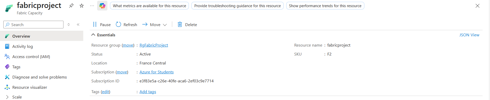

# 🚀 Fabric End-to-End Data Project

## 📘 Overview
This project demonstrates a complete **end-to-end data pipeline** built using **Microsoft Fabric**, starting from data ingestion in **Azure Blob Storage**, processing and transformation through **Fabric Lakehouse** and **Notebooks**, and ending with data visualization in **Power BI**.  
The main goal of this project is to showcase a unified workflow that integrates all data engineering stages — from extraction to insight delivery.

---

## 🧩 Architecture Overview
The architecture includes the following components:

- **Azure Resource Group** – used to host and organize all project resources.
- **Fabric Capacity** – enabled to manage workloads and connect multiple Fabric workspaces.
- **Azure Blob Storage** – serves as the raw data source.
- **Fabric Workspaces (3 total)** – used for data organization, pipeline creation, and Lakehouse management.
- **Fabric Pipelines** – automate data movement from Blob Storage to Lakehouse.
- **Fabric Notebooks** – used for data transformation and validation.
- **Power BI** – for creating interactive dashboards and business insights.

<!-- Add image here (Architecture Diagram) -->

---

## ⚙️ Step-by-Step Implementation

### 1️⃣ Create Resource Group
- Created a new **Azure Resource Group** to hold all Fabric and storage resources.

---

### 2️⃣ Configure Fabric Capacity
- Enabled **Fabric Capacity** within the resource group to allocate compute resources.
- Connected Fabric workspaces to this capacity for seamless performance.

---

### 3️⃣ Set Up Azure Blob Storage
- Created a **Blob Storage account** and a dedicated **container** to upload raw data.
- Uploaded CSV datasets into the container for further processing.

---

### 4️⃣ Create and Link Fabric Workspaces
- Built **three Fabric workspaces** for structured data management.
- Each workspace connected to the same Fabric Capacity for centralized control.

---

### 5️⃣ Build Data Pipelines
- Designed **Fabric Pipelines** to automate the **ETL process**:
  - **Extract** data from Blob Storage.
  - **Load** it into the Lakehouse.
  - **Transform** and validate the data using Notebooks.

- Created multiple pipeline runs to move data incrementally and verify process completion.

---

## 6️⃣ 🪶 Medallion Architecture Breakdown

### 🟤 Bronze Layer
The **Bronze layer** stores the **raw data** ingested directly from Azure Blob Storage.  
- Data remains unprocessed to preserve its original form.  
- Used mainly for auditing and reprocessing when needed.  
- Acts as the foundation for the Silver layer transformations.

<!-- Add image here (Bronze Screenshot) -->

---

### ⚪ Silver Layer
The **Silver layer** contains **cleaned, validated, and standardized data**.  
- Applied transformations using Fabric Notebooks and Pipelines.  
- Removed duplicates, handled missing values, and standardized formats.  
- Acts as the trusted source for analytics and Gold-level aggregation.

<!-- Add image here (Silver Screenshot) -->

---

### 🟡 Gold Layer
The **Gold layer** holds **curated and aggregated datasets** ready for reporting.  
- Data is modeled for business KPIs and Power BI visualization.  
- Includes summary tables and calculated fields.  
- Optimized for performance and direct Power BI connection.

<!-- Add image here (Gold Screenshot) -->

---

### 7️⃣ Data Transformation with Fabric Notebooks
- Connected **Fabric Notebooks** to the Lakehouse for data transformation and validation.
- Performed cleaning, formatting, and schema adjustments to prepare data for visualization.

<!-- Add image here (Notebook Screenshot) -->

---

### 8️⃣ Visualization in Power BI
- Integrated the final Lakehouse dataset with **Power BI**.
- Created interactive **dashboards and reports** to visualize insights and KPIs.

<!-- Add image here (Power BI Dashboard Screenshot) -->

---

## 🧠 Key Learnings
- Hands-on experience with **Microsoft Fabric end-to-end workflows**.
- Deep understanding of **data ingestion, transformation, and visualization** pipelines.
- Learned to connect **Azure and Power BI environments** effectively.
- Solved a complex pipeline issue independently — a step that failed during instructor testing.

---

## 🛠️ Tools & Technologies
- **Microsoft Fabric**
- **Azure Blob Storage**
- **Fabric Lakehouse**
- **Fabric Notebooks**
- **Power BI**
- **Data Pipelines**

---

## 📈 Project Outcome
A fully functional data pipeline capable of ingesting, transforming, and visualizing business data in a unified environment — from raw files in Azure Blob Storage to interactive dashboards in Power BI.

<!-- Add final image here (Full Workflow Summary or Dashboard Overview) -->

---

## 🧑‍💻 Author
**Hanin Baher**  
Data Engineer | Microsoft Fabric & Power BI Enthusiast  
[LinkedIn](#) • [Portfolio](#)
